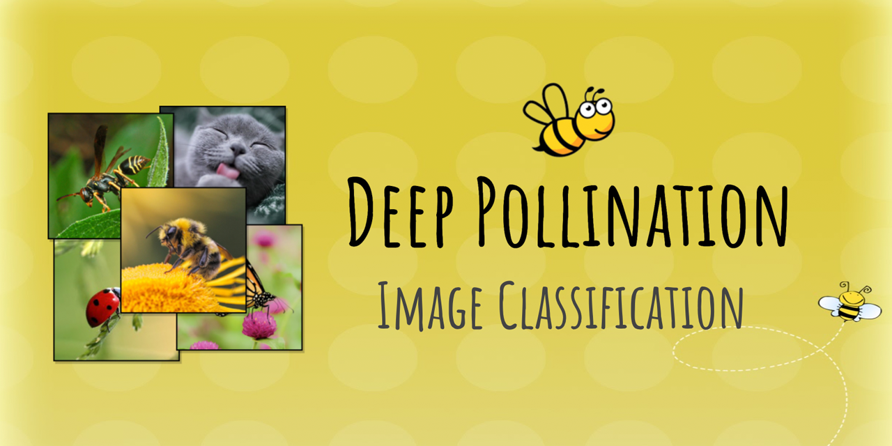
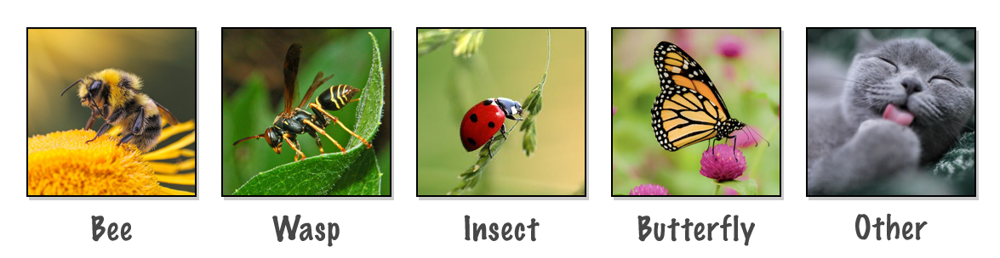

# Deep-Pollination
This repository is the main repository for the **Deep-Pollination** project.

  

## Introduction
Insects are very important for biodiversity, food chains, and pollination. It is of great importance to recognize insects, their habitats and to secure their natural environment. Machine learning, especially deep learning techniques can be used to recognize and classify various insects. We introduce **Deep-Pollination**, a series of three machine learning challenges organized on Codalab for insects classification. A preprocessed version of the insects dataset is used for these challenges which consists of five classes and more than 200,000 images. This work has been accepted as a poster in Junior Data Science and Engineering Conference (JDSE) 2021 organized by Labex Digicosme, Université Paris-Saclay.

  

## Introductory Video
https://www.youtube.com/watch?v=T8ALa9phYGY&feature=youtu.be

  

## Poster: 
The accepted poster in JDSE 2021 of this project can be found [here](poster.pdf).

  

## Paper: 
The accepted paper in JDSE 2021 of this project can be found [here](JDSE_2021_Deep_Pollination.pdf).

  

## Data
The data is provided by MUSÉUM NATIONAL D’HISTOIRE NATURELLE. The data set contains 5 classes where each class refers to a type of insect:
-   bee 
-   wasp
-   butterfly 
-   other insect
-   other(non-insect)  

There are more than 210,000 images provided for this competition.

  

## Codalab Challaneges
There are 3 codalab challenges in the Deep-Pollination project:
1.  [Challenge 1](https://competitions.codalab.org/competitions/28635)
2.  [Challenge 2](https://competitions.codalab.org/competitions/28996)
3.  [Challenge 3](https://competitions.codalab.org/competitions/29425)

  

## Team: 
Team Ecologists have enabled the creation of the ***Deep-Pollination*** challenge.
- [Ihsan Ullah](https://github.com/ihsanullah2131)
- [Mohammed Lansari](https://github.com/mlansar)
- Vaibhav Arora
- Thibut Soulard
- Xavier Bou
- Eric Santiago

  

## Supervisor: 
This project was supersied by [Professor Isabelle Guyon](https://guyon.chalearn.org/).

  

## References and credits:
- The competition protocol was designed by [Professor Isabelle Guyon](https://guyon.chalearn.org/)

-   The starting kit was adapted from an Jupyper notebook designed by Balazs Kegl
-   [AutoDL](https://competitions.codalab.org/competitions/27082) baseline model was provided by Michael Vaccaro
-   [MUSÉUM NATIONAL D’HISTOIRE NATURELLE](https://www.mnhn.fr/) and [SPIPOLL](https://www.spipoll.org/) provided the data
-   [Université Paris Saclay](https://www.universite-paris-saclay.fr/) organized this project
-   [ChaLearn](http://www.chalearn.org/) supported the project
-   [Codalab](https://competitions.codalab.org/) hosted the competitions
-   This project was partially funded by [Labex Digicosme](https://digicosme.cnrs.fr/) (project ANR11LABEX0045DIGICOSME) operated by ANR as part of the program   Investissement d’Avenir Idex ParisSaclay (ANR11IDEX000302)

  

## Contact: 
Team Ecologists (ecologists@chalearn.org)  
Ihsan Ullah (ihsan.ullah@universite-paris-saclay.fr)

